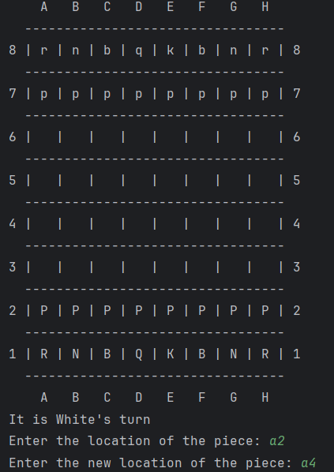
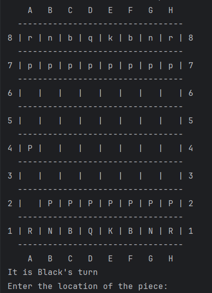
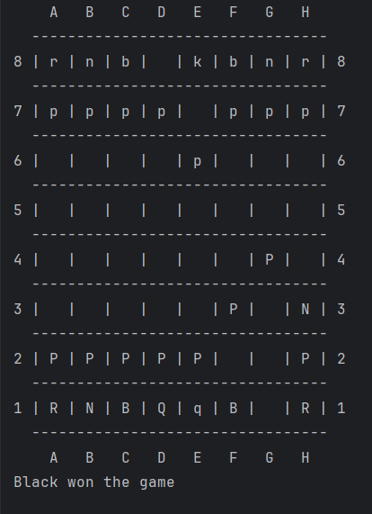

# Chess Game

A simple Java implementation of a terminal-based chess game.

## Overview

This project implements a chess game in Java that runs in the terminal. It allows players to make moves by entering commands and displays the current state of the game on the terminal.

## Features

- Terminal-based user interface
- Basic move validation
- Implementation of standard chess rules
- Support for all standard chess pieces: pawn, king, queen, rook, bishop, and knight
- Not supported for castling and en passant

## Installation

To run the chess game, you need to have Java installed on your system. You can compile and run the game using the following steps:

1. Clone this repository to your local machine:

```bash
git clone https://github.com/yasinunl/chessgame.git
```
# Navigate to the project directory
```bash
cd chess-game
```
# Compile the Java files
```bash
javac *.java
```
# Run the main class to start the game
```bash
java Main
```
# How to Play
Once the game is running, follow the prompts on the terminal to make your moves. Moves should be entered in algebraic notation (e.g., "e2 e4").

# Images from the game



# Finishing game
!You have to defeat king to finish the game




# Contributing
Contributions to improve the game are welcome! If you'd like to contribute, please fork the repository, make your changes, and submit a pull request.

